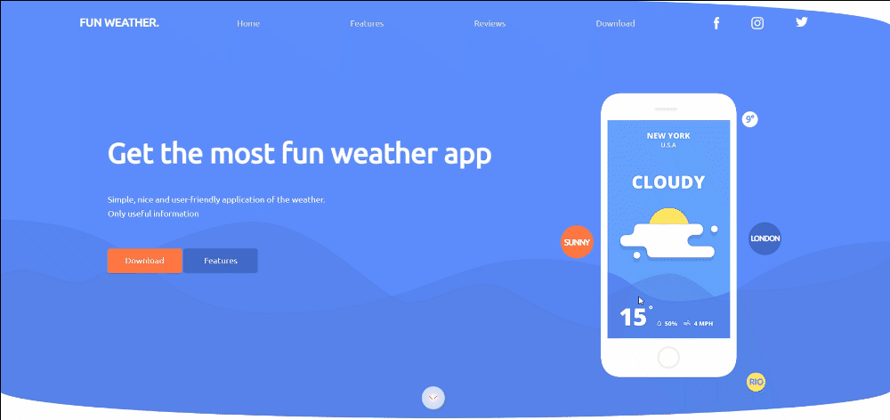

**This is a conversion from a professional PSD template &#x1F9F9; using Vanilla CSS/HTML**
I haven't used any CSS frameworks or HTML helpers, just basic VSCODE stuff.

Surely I learned a lot about my personal coding style especially in CSS and how to manage separately organized style sheets which proved to be a quite helpful concept when handling challenging design elements in line with the "separation of concerns principle".	&#10004;

 

meeting designer's expectations and guidelines, pixel to pixel fidelity	&#x1F4CF;, as well as achieving maximum responsivity across different window sizes :desktop_computer:, were key concepts that I improved while coding this project:

This design is based on the contest winning PSD provided by [Bionocopy](https://gumroad.com/bionocopy) He was humble enough to share this online.
original .psd as well as a .png from it are provided in the src folder.
